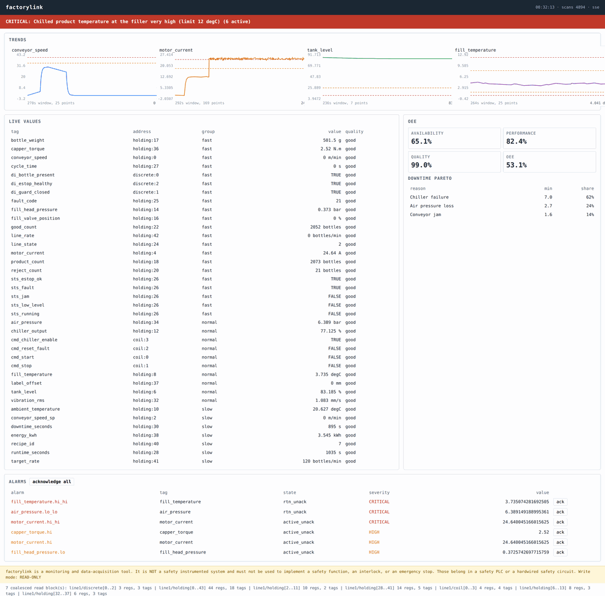
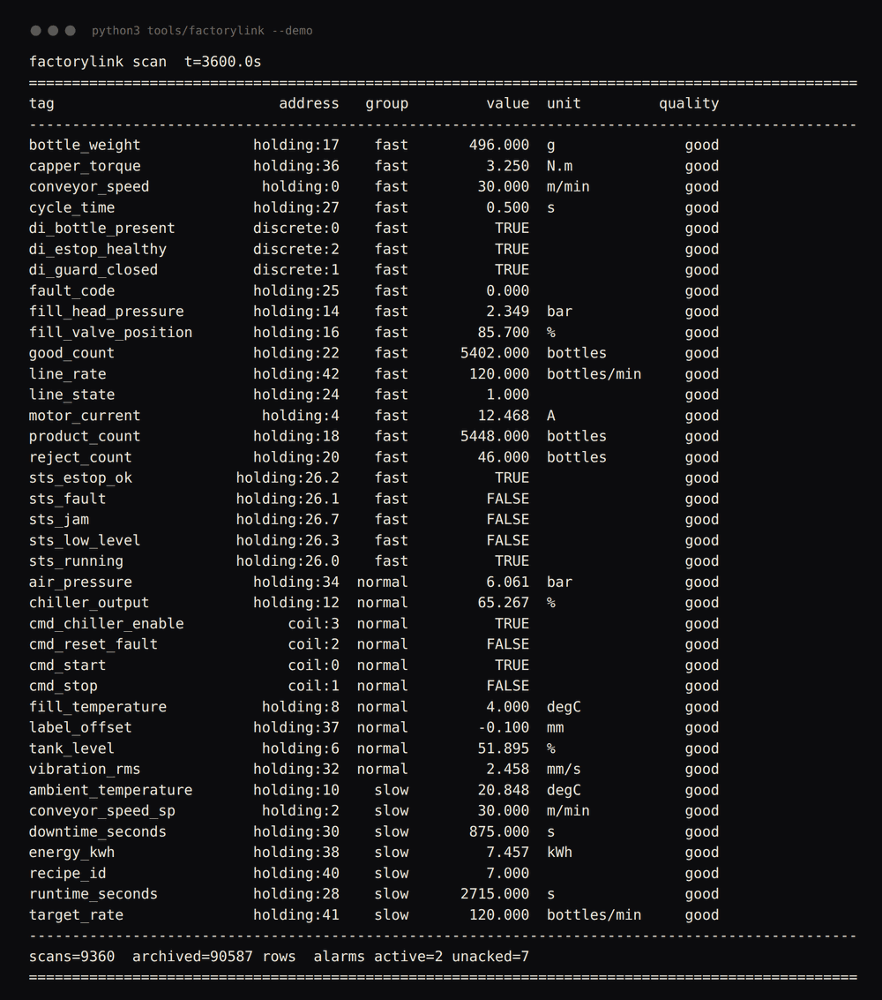
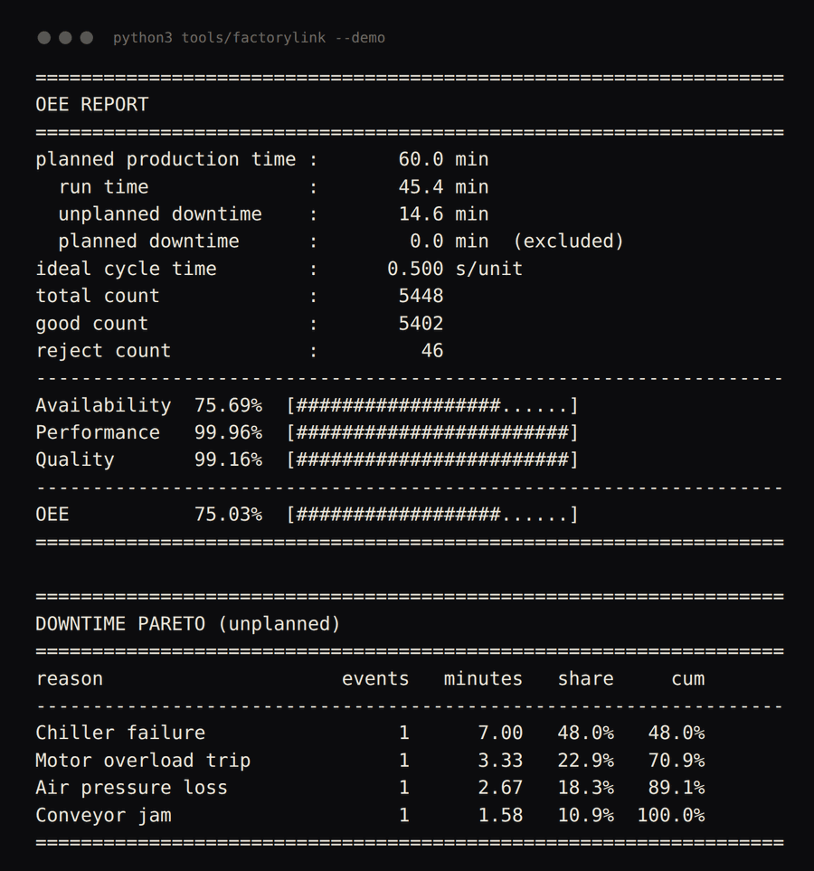

# industrial-automation-suite


**Get data off your PLCs and make it visible and actionable — a Modbus/OPC UA
acquisition stack with alarms, a compressing historian, OEE and a live
dashboard, running end to end with no hardware.**

Python package name: `factorylink`.

---

## Screenshots


The dashboard served by `factorylink serve`, running against the built-in simulated bottling line with four faults injected. Trends, 38 live tags, OEE, the downtime Pareto and six active alarms - all rendered server-side as inline SVG, with no npm and no internet access.


`factorylink --demo` after a simulated one-hour shift: every tag decoded from its raw registers, with its address, poll group, engineering value and quality flag.


The OEE report and downtime Pareto from the same run. Availability, performance and quality are kept separate, and the Pareto says which fault to go and fix first.

---

## The problem

The data is already in the PLC. Somebody wants it on a screen, or in a
database, or in a shift report. Between those two facts sits a week of work
that always goes the same way:

- The float reads as `-1.6e-23`, because the device is CDAB and your library
  assumed ABCD. Nothing raises. You get a number, and it is nonsense.
- You poll all thirty tags every 100 ms because that seemed sensible, and the
  PLC's scan time doubles and the HMI goes sluggish.
- You put a high limit on a noisy motor current, and by lunchtime the alarm
  list has 1,800 entries from that one tag and nobody reads it any more.
- You log every sample of every tag and the SQLite file on the HMI box fills
  the disk in six weeks.
- Somebody asks for OEE and you compute performance from the good count, so
  the scrap is counted twice and the number is quietly wrong.
- The one thing everybody agrees on is that the acquisition tool must never,
  under any circumstances, write something stupid to the line.

We build the bridge in the middle: the acquisition layer that handles all of
that, and the dashboard that makes it worth having.

---

## What it does

- **Modbus register decoding written from first principles** — int16, uint16,
  int32, uint32, float32, float64 across register pairs, all four word/byte
  order combinations (ABCD, CDAB, BADC, DCBA), bit extraction from packed
  status words and coils, scale and offset. Every combination is unit-tested
  against known byte patterns.
- **A validated tag database** in YAML or CSV — address, area, type, word
  order, scale, unit, deadband, poll group, alarm limits. Overlapping
  addresses, unknown types, impossible ranges and unreachable alarm limits are
  all reported together, not one per run.
- **Register-range coalescing** — 21 tags scattered over 44 registers become
  **2 requests**, not 21. Never merges across devices or register areas, never
  exceeds the 125-register / 2000-bit protocol limits, and the greedy merge is
  tested against a brute-force reference for minimality.
- **Poll groups, staggering and slow-scan detection** — different rates for
  different tags, phases offset so groups do not all fire at once, per-device
  connection health with exponential reconnect backoff, and an overrun flag
  when a scan eats its own period.
- **An alarm engine that does not flood** — high/high-high/low/low-low, rate
  of change, deviation from setpoint, digital state; with hysteresis, on-delay
  and off-delay timers, latching, severity, bounded shelving, and EEMUA-style
  flood detection.
- **A historian that compresses** — deadband exception reporting plus
  swinging-door compression implemented from scratch, in SQLite from the
  standard library, with interval aggregation, retention and CSV export.
- **OEE, computed the way the standard defines it** — availability,
  performance, quality, the composite, planned vs unplanned downtime kept
  separate, performance over 100% flagged rather than hidden, and a downtime
  Pareto that says what to go and fix.
- **A dashboard with zero build step** — stdlib HTTP server, one HTML file,
  trend charts as inline SVG generated on the server. No npm, no CDN, no
  internet access required. Works on an air-gapped box.
- **A write path that is shut by default** — read-only mode, an explicit
  allow-list, engineering-range clamping, per-tag rate limiting, single-use
  confirmation tokens for critical tags, and an audit log of every attempt
  including the refusals.
- **A simulated PLC that is not a mock** — a bottling line with conveyor lag,
  thermal lag, a draining and refilling tank, load-dependent motor current,
  vibration, a capper, counters, a state machine and seven injectable faults.
  It renders into a real Modbus register image which the driver decodes
  through the real codec. Every test and the whole demo run against it.

`pymodbus`, `asyncua` and `paho-mqtt` are optional. Every module imports
without them, and the entire test suite passes without any of them installed.

---

## Quickstart

One command, no hardware, no broker, no network:

```bash
git clone https://github.com/Pratyush150/industrial-automation-suite
cd industrial-automation-suite
pip install pyyaml
python3 tools/factorylink --demo
```

That runs a simulated one-hour shift with four injected faults in about seven
seconds of wall time, and prints the live tag table, the alarm list, OEE, the
downtime Pareto, the historian's achieved compression, and the safety layer
refusing four different bad writes.

The live dashboard:

```bash
python3 tools/factorylink serve --port 8377
# then open http://127.0.0.1:8377/
```

Tests:

```bash
python3 -m pytest -q      # 300 tests
```

---

## How it works

```
                      config/tags_bottling_line.yaml
                      config/alarms.yaml  config/devices.yaml
                                 |
                                 v
  +---------------------------------------------------------------+
  |  tags.py        TagDatabase: name, device, area, address,     |
  |                 data type, word/byte order, scale, deadband,  |
  |                 poll group, alarm limits. Validated as a whole|
  +---------------------------------------------------------------+
                                 |
                                 v
  +---------------------------------------------------------------+
  |  poller.py      poll groups -> coalesce_blocks() -> the fewest |
  |                 legal reads; staggering; connection health     |
  |                 with backoff; scan overrun detection           |
  +---------------------------------------------------------------+
                                 |
                                 v
  +---------------------------------------------------------------+
  |  protocols/     Driver ABC: read(tags) -> {name: Reading}      |
  |    simulator.py   process model + register image (no deps)     |
  |    modbus_tcp.py  modbus_rtu.py  opcua.py  mqtt_sparkplug.py   |
  |                                        (all guarded imports)   |
  |    modbus_codec.py  pure decode: word order, byte order, bits  |
  +---------------------------------------------------------------+
                                 |
             Reading(tag, value, timestamp, quality, raw)
                                 |
        +------------------------+------------------------+
        v                        v                        v
  +-----------+           +-------------+          +-------------+
  | historian |           |   alarms    |          |     oee     |
  | deadband  |           | hysteresis  |          | A x P x Q   |
  | swinging  |           | on/off delay|          | downtime    |
  |   door    |           | latch/shelve|          |   Pareto    |
  |  SQLite   |           | flood detect|          |             |
  +-----------+           +-------------+          +-------------+
        |                        |                        |
        +------------------------+------------------------+
                                 v
  +---------------------------------------------------------------+
  |  dashboard.py   stdlib HTTP server, one HTML file, inline SVG  |
  |                 trends rendered server-side, alarm banner and  |
  |                 ack buttons, OEE panel. SSE or polling.        |
  +---------------------------------------------------------------+

  safety.py sits across the write path only:
      caller -> WriteGuard.check() -> Driver.write()
      read-only default / allow-list / clamp / rate limit / token
```

**The scan cycle**, in the order it happens, because the order matters:

1. Poll the groups that are due. Their tags were coalesced into blocks at
   construction time, so this is a fixed number of round trips.
2. Archive the readings, compressed — *before* anything else looks at them, so
   every value an alarm fired on is in the history.
3. Evaluate alarms against exactly the same values, so the alarm list and the
   trend can never disagree about what the process was doing.
4. Write alarm transitions into the historian's event table, next to the trend
   data they refer to.
5. Update the OEE counters and the run/stop state.

**One clock.** Poll scheduling, alarm delays, historian timestamps, OEE
windows, rate limits and token expiry all read the same injected clock object.
In production it is the system clock; in the tests and in `--demo` it is a
`ManualClock` that only moves when it is told. That is why a simulated hour
takes seven seconds and gives the same numbers every time.

---

## Worked example

Real output from `python3 tools/factorylink --demo`, pasted verbatim.

### The read plan

```
$ python3 tools/factorylink dump-tags --plan

==============================================================================
COALESCED READ PLAN
==============================================================================
group fast        21 tags -> 2 request(s)
    line1/discrete[0..2] 3 regs, 3 tags  (padding 0 regs)
    line1/holding[0..43] 44 regs, 18 tags  (padding 23 regs)
group slow         7 tags -> 2 request(s)
    line1/holding[2..11] 10 regs, 2 tags  (padding 6 regs)
    line1/holding[28..41] 14 regs, 5 tags  (padding 6 regs)
group normal      10 tags -> 3 request(s)
    line1/coil[0..3] 4 regs, 4 tags  (padding 0 regs)
    line1/holding[6..13] 8 regs, 3 tags  (padding 2 regs)
    line1/holding[32..37] 6 regs, 3 tags  (padding 1 regs)
==============================================================================
```

38 tags, 7 requests per full sweep instead of 38. The fast group -- the 21
tags an operator watches move -- costs two round trips every 500 ms.

### The scan table

```
================================================================================================
factorylink scan  t=3600.0s
================================================================================================
tag                          address   group         value  unit         quality
------------------------------------------------------------------------------------------------
bottle_weight             holding:17    fast       496.000  g               good
capper_torque             holding:36    fast         3.250  N.m             good
conveyor_speed             holding:0    fast        30.000  m/min           good
cycle_time                holding:27    fast         0.500  s               good
di_bottle_present         discrete:0    fast          TRUE                  good
di_estop_healthy          discrete:2    fast          TRUE                  good
di_guard_closed           discrete:1    fast          TRUE                  good
fault_code                holding:25    fast         0.000                  good
fill_head_pressure        holding:14    fast         2.349  bar             good
fill_valve_position       holding:16    fast        85.700  %               good
good_count                holding:22    fast      5402.000  bottles         good
line_rate                 holding:42    fast       120.000  bottles/min     good
line_state                holding:24    fast         1.000                  good
motor_current              holding:4    fast        12.468  A               good
product_count             holding:18    fast      5448.000  bottles         good
reject_count              holding:20    fast        46.000  bottles         good
sts_estop_ok            holding:26.2    fast          TRUE                  good
sts_fault               holding:26.1    fast         FALSE                  good
sts_jam                 holding:26.7    fast         FALSE                  good
sts_low_level           holding:26.3    fast         FALSE                  good
sts_running             holding:26.0    fast          TRUE                  good
air_pressure              holding:34  normal         6.061  bar             good
chiller_output            holding:12  normal        65.267  %               good
cmd_chiller_enable            coil:3  normal          TRUE                  good
cmd_reset_fault               coil:2  normal         FALSE                  good
cmd_start                     coil:0  normal          TRUE                  good
cmd_stop                      coil:1  normal         FALSE                  good
fill_temperature           holding:8  normal         4.000  degC            good
label_offset              holding:37  normal        -0.100  mm              good
tank_level                 holding:6  normal        51.895  %               good
vibration_rms             holding:32  normal         2.458  mm/s            good
ambient_temperature       holding:10    slow        20.848  degC            good
conveyor_speed_sp          holding:2    slow        30.000  m/min           good
downtime_seconds          holding:30    slow       875.000  s               good
energy_kwh                holding:38    slow         7.457  kWh             good
recipe_id                 holding:40    slow         7.000                  good
runtime_seconds           holding:28    slow      2715.000  s               good
target_rate               holding:41    slow       120.000  bottles/min     good
------------------------------------------------------------------------------------------------
scans=9360  archived=90587 rows  alarms active=2 unacked=7
================================================================================================
```

Note `sts_*` at `holding:26.0` through `holding:26.7`: five booleans extracted
from one status word. `motor_current` at `holding:4` is a CDAB float32 and
`vibration_rms` at `holding:32` is BADC — mixed on purpose, because a real
line is a mix of vendors.

### Alarms, and what acknowledgement does

```
================================================================================================
ALARMS  active=2  unacked=7  shelved=0  rate(10 min)=0
================================================================================================
alarm                          severity        state     value  message
------------------------------------------------------------------------------------------------
conveyor_jam                   CRITICAL    rtn_unack     False  Conveyor jam sensor tripped...
fill_temperature.hi_hi         CRITICAL    rtn_unack     4.000  Chilled product temperature...
air_pressure.lo_lo             CRITICAL    rtn_unack     6.061  Plant compressed air header...
motor_current.hi_hi            CRITICAL    rtn_unack    12.468  Conveyor motor RMS current ...
capper_torque.hi_hi            CRITICAL active_unack     3.250  Capper applied torque, last...
temperature_runaway                HIGH    rtn_unack     4.000  Fill temperature climbing f...
capper_torque.hi                   HIGH active_unack     3.250  Capper applied torque, last...
================================================================================================

operator acknowledges everything (7 alarm(s)) ...
latched alarms whose condition has cleared now leave the list; alarms still active stay:
================================================================================================
ALARMS  active=2  unacked=0  shelved=0  rate(10 min)=0
================================================================================================
alarm                          severity        state     value  message
------------------------------------------------------------------------------------------------
capper_torque.hi_hi            CRITICAL   active_ack     3.250  Capper applied torque, last...
capper_torque.hi                   HIGH   active_ack     3.250  Capper applied torque, last...
================================================================================================
```

`rtn_unack` is a latched alarm whose condition has cleared but which still
needs an operator. Acknowledging drops those and leaves the two that are
genuinely still active — the capper torque has drifted up over the hour and
has not come back.

### OEE and the downtime Pareto

```
==================================================================
OEE REPORT
==================================================================
planned production time :       60.0 min
  run time              :       45.4 min
  unplanned downtime    :       14.6 min
  planned downtime      :        0.0 min  (excluded)
ideal cycle time        :      0.500 s/unit
total count             :       5448
good count              :       5402
reject count            :         46
------------------------------------------------------------------
Availability  75.69%  [##################......]
Performance   99.96%  [########################]
Quality       99.16%  [########################]
------------------------------------------------------------------
OEE           75.03%  [##################......]
==================================================================

==================================================================
DOWNTIME PARETO (unplanned)
==================================================================
reason                     events   minutes   share     cum
------------------------------------------------------------------
Chiller failure                 1      7.00   48.0%   48.0%
Motor overload trip             1      3.33   22.9%   70.9%
Air pressure loss               1      2.67   18.3%   89.1%
Conveyor jam                    1      1.58   10.9%  100.0%
==================================================================
```

The Pareto is the point. OEE says there is a 24% availability loss; the Pareto
says 71% of it is two events.

### Compression actually achieved

```
================================================================================================
HISTORIAN
================================================================================================
samples received 171720, archived 90587 (overall ratio 0.527)
tag                     received  stored   ratio  deadband  tolerance
------------------------------------------------------------------------------------------------
conveyor_speed              7200     183   0.025       0.1        0.2
tank_level                  1800      78   0.043       0.2        0.4
fill_temperature            1800     297   0.165      0.05        0.1
product_count               7200      76   0.011       0.5          1
motor_current               7200     787   0.109       0.1        0.2
energy_kwh                   360      82   0.228     0.005       0.01
================================================================================================
```

These are measured, not claimed. The overall 0.527 is dragged up by tags whose
configured deadband is smaller than their actual noise — which is itself the
diagnosis: if a signal will not compress, the tolerance is tighter than the
instrument's real accuracy and you are paying disk to archive noise.

### The write path refusing to cooperate

```
================================================================================================
SAFETY / WRITE PATH
================================================================================================
factorylink is a monitoring and data-acquisition tool. It is NOT a safety instrumented system and must not be used to implement a safety function, an interlock, or an emergency stop. Those belong in a safety PLC or a hardwired safety circuit.
------------------------------------------------------------------------------------------------
default read-only mode   REFUSED  ReadOnlyModeError: refusing to write conveyor_speed_sp: this instance is in read-only mode. Writes require an explicit WritePolicy with read_only=False.
                         ... writes enabled for conveyor_speed_sp only
tag not on allow-list    REFUSED  NotAllowListedError: refusing to write target_rate: it is not on the write allow-list (1 tag(s) allowed)
value out of range       ACCEPTED requested 999 -> applied 45 m/min (clamped=True)
value in range           ACCEPTED requested 28 -> applied 28 m/min (clamped=False)
rate limit               REFUSED  RateLimitedError: conveyor_speed_sp: 6 writes in the last 60s, limit is 6
================================================================================================
```

---

## Connecting it to a real PLC

Three steps.

**1. Write the tag map.** Start from `config/tags_bottling_line.yaml`. The
fields that matter and the fields people get wrong are documented in the file
itself. Validate it before you go near the plant:

```bash
python3 tools/factorylink dump-tags --config my_plant.yaml --plan
```

Every overlapping address, unknown type, impossible range and unreachable
alarm limit is reported in one pass.

**2. Find the word order** — do not guess. `examples/01_decode_a_register_dump.py`
decodes one register pair all four ways and shows which is plausible. It takes
two minutes and saves an afternoon. See docs/FIELD_NOTES.md §1.

**3. Point a driver at it.**

```python
from factorylink.poller import Poller
from factorylink.protocols.base import ModbusEndpoint
from factorylink.protocols.modbus_tcp import ModbusTcpDriver
from factorylink.tags import TagDatabase

db = TagDatabase.load("my_plant.yaml")
driver = ModbusTcpDriver(ModbusEndpoint(host="192.0.2.20", port=502, unit_id=1))
poller = Poller({"line1": driver}, db, {"fast": 0.5, "normal": 2.0, "slow": 10.0})
poller.run(60.0)
```

Everything above the driver — poller, alarms, historian, OEE, dashboard — is
protocol-agnostic and does not change.

---

## What this handles that a tutorial does not

- **All four Modbus word/byte order combinations**, tested against known byte
  patterns in both directions. A tutorial calls `decode_32bit_float()` and
  works on the vendor the author owned.
- **Register coalescing with the protocol limits enforced.** 125 registers,
  2000 bits, never across devices, never across register areas. The minimality
  of the merge is checked against a brute-force reference in the tests.
- **Bad quality is not zero.** A failed read produces `Quality.BAD` with
  `value=None`. Alarms hold their state through it; the historian refuses to
  archive it. A system that logs a comms failure as `0.0` will raise a
  low-level alarm because a switch rebooted.
- **Alarm chatter.** Hysteresis, on-delay, off-delay, latching and bounded
  shelving, because a bare limit comparison on a noisy signal produces 1,789
  events an hour from one tag (`examples/03_alarm_chatter.py` — measured, not
  estimated).
- **Reconnect backoff.** A dead device is retried on an exponential schedule,
  not once per scan. Otherwise one dead PLC turns the scan loop into a queue
  of connect timeouts and takes the healthy devices down with it.
- **Scan overrun detection.** When a scan uses more than 80% of its period,
  the loop says so and skips forward whole periods instead of building an
  unbounded backlog.
- **Serial RTU timing.** Inter-frame gaps computed from the baud rate
  (4.01 ms at 9600, 1.75 ms fixed above 19200), and the FTDI 16 ms latency
  timer documented as the first thing to check when RTU "has noise".
- **pymodbus version drift.** `unit=` became `slave=` became `device_id=`
  across 2.x, 3.0 and 3.7. The driver tries each rather than pinning a version
  that will be wrong in a year.
- **Sparkplug death certificates.** The NDEATH payload is registered as the
  MQTT will at connect, so a consumer can tell "nothing changed" from "the
  gateway is gone".
- **A write path that starts shut.** Read-only default, allow-list, clamping,
  rate limiting, single-use confirmation tokens, and an audit log that records
  refusals.

---

## Limitations

Read these before you decide this is the right tool.

- **This is not a safety system.** No SIL rating, no redundancy, no proof-test
  interval, no defined behaviour on loss of power or network. It runs on a
  general-purpose OS over a general-purpose network. Safety functions belong
  in a safety PLC or a hardwired relay; interlocks belong in the control PLC.
  The write guard is a second line of defence, never the first.
- **The scan loop is single-threaded and synchronous.** That is a deliberate
  trade for testability and for being easy to hand over. It is not the right
  shape for hundreds of devices with wildly different latencies; at that scale
  you want one process per device group.
- **Sub-100 ms determinism is not on offer.** Python, a general-purpose OS and
  a plant network cannot give you that. If you need hard real time, it belongs
  in the PLC.
- **The Modbus and OPC UA drivers have not been exercised against a physical
  device in this repository.** The codec, coalescing, scheduling, alarms,
  historian, OEE and safety layers are all tested end to end against the
  simulator; the transport wrappers are thin, and their pure logic (timing,
  node-id mapping, version-tolerant calls) is unit-tested, but the socket path
  itself is not covered by a test here.
- **OPC UA support is basic**: read and write of scalar nodes. No
  subscriptions, no certificate management, no browsing of the address space,
  no complex or array types.
- **The Sparkplug payload is JSON, not protobuf.** The topic namespace,
  birth/death certificates, aliases and sequence numbers are all correct, but
  a consumer that requires the binary protobuf encoding needs
  `SparkplugPublisher.encode_payload` replaced.
- **SQLite is the historian.** Fine for one line and months of data on a small
  industrial PC. Not the right answer for a whole plant or for multi-year
  retention — swap in InfluxDB or TimescaleDB behind the same six methods.
- **The dashboard has no authentication** and binds to loopback by default.
  Putting it on a plant network is a deliberate act; put it behind something
  that does authentication first.
- **Compressed history is an approximation.** Swinging door guarantees
  ±tolerance against the door slope; rebuilding by joining archived points
  costs up to 2× tolerance. Choose the tolerance from the instrument's
  accuracy, not from a storage target.
- **The simulated line is a plausible process model, not a digital twin** of
  any real machine. It exists so the acquisition stack can be exercised and
  tested, not to predict a plant's behaviour.

---

## Repository layout

```
src/factorylink/
  datatypes.py            data types, word/byte order, areas, protocol limits
  clock.py                SystemClock and ManualClock
  tags.py                 TagDef, TagDatabase, YAML/CSV loading, validation
  poller.py               coalesce_blocks, poll groups, health, overruns
  alarms.py               alarm types, hysteresis, delays, latching, flood
  historian.py            SwingingDoor, SQLite storage, aggregation, retention
  oee.py                  availability/performance/quality, downtime Pareto
  dashboard.py            HTTP server, SVG trends, single-file page
  safety.py               WritePolicy, WriteGuard, tokens, clamping, audit
  runtime.py              wiring and CLI output formatting
  cli.py                  subcommands and --demo
  protocols/
    base.py               Driver ABC, Reading, Quality
    modbus_codec.py       pure register encode/decode
    simulator.py          bottling line model + register image + driver
    modbus_tcp.py         pymodbus, guarded
    modbus_rtu.py         pymodbus + serial timing, guarded
    opcua.py              asyncua, guarded
    mqtt_sparkplug.py     paho-mqtt, guarded
config/
  tags_bottling_line.yaml 38-tag example map, heavily commented
  tags_bottling_line.csv  the same map as CSV
  alarms.yaml             rate-of-change, deviation and digital alarms
  devices.yaml            devices, poll rates, historian, OEE, safety
docs/
  FIELD_NOTES.md          word-order debugging, RTU timing, polling load,
                          network segmentation, alarm rationalisation
  ARCHITECTURE.md         data flow, design decisions, how to extend it
examples/
  01_decode_a_register_dump.py    identify a device's word order
  02_poll_the_simulated_line.py   the read plan and what it saves
  03_alarm_chatter.py             what a missing deadband costs
  04_compression_tradeoff.py      fidelity vs storage, measured
  05_shift_report.py              an 8-hour shift, OEE and Pareto
tests/                    12 files, 300 tests
tools/factorylink         CLI entry point
```

## CLI

```
factorylink --demo                      full end-to-end demonstration
factorylink scan --duration 30          poll and print a live table
factorylink dump-tags --plan            the tag map and the coalesced reads
factorylink simulate --fault jam@120:90 run the line with injected faults
factorylink history --tag tank_level    aggregated history for one tag
factorylink oee --duration 1800         OEE report and downtime Pareto
factorylink serve --port 8377           the live dashboard
```

Faults available for injection: `jam`, `motor_overload`, `chiller_failure`,
`low_tank`, `air_leak`, `sensor_stuck`, `comms_drop`.

---

## Related work

Part of a set of engineering repositories we maintain:

| Repo | Category | One-line |
|---|---|---|
| [workflow-automation-engine](https://github.com/Pratyush150/workflow-automation-engine) | Automation & AI | DAG workflow runner with retries, idempotency, scheduling, connectors |
| [llm-faq-assistant](https://github.com/Pratyush150/llm-faq-assistant) | Automation & AI | Retrieval-grounded FAQ assistant with citations and an eval harness |
| [fleet-ops-dashboard](https://github.com/Pratyush150/fleet-ops-dashboard) | Product | Web dashboard for monitoring a fleet of robots and drones |
| [flight-log-analyzer](https://github.com/Pratyush150/flight-log-analyzer) | Robotics & control | PX4 ULog / ArduPilot log forensics with a ranked findings report |
| [px4-mavlink-companion](https://github.com/Pratyush150/px4-mavlink-companion) | Robotics & control | MAVLink bridge, stale-telemetry watchdog, offboard control, diagnostics |
| [drone-control-toolkit](https://github.com/Pratyush150/drone-control-toolkit) | Robotics & control | PID/LQR/EKF control and estimation with a simulation harness |
| [jetson-realtime-detection](https://github.com/Pratyush150/jetson-realtime-detection) | Robotics & control | Real-time detection and tracking tuned for Jetson and edge boards |
| [lidar-slam-toolkit](https://github.com/Pratyush150/lidar-slam-toolkit) | Robotics & control | LiDAR SLAM configs plus extrinsics, time-sync and drift diagnostics |
| [ros2-diffdrive-robot](https://github.com/Pratyush150/ros2-diffdrive-robot) | Robotics & control | ROS 2 differential-drive robot: URDF, Gazebo, serial motor interface |
| [ros2-drone-bringup](https://github.com/Pratyush150/ros2-drone-bringup) | Simulation & testing | ROS 2 PX4 bringup: geodesy, missions, geofence, state machine, SITL |
| [robot-sim-test-harness](https://github.com/Pratyush150/robot-sim-test-harness) | Simulation & testing | Scenario-driven regression testing for robots in simulation |

We work on real hardware, not just in simulation, which is why the failure
modes in docs/FIELD_NOTES.md are specific.

Site: https://pratyush150.github.io

## License

MIT. Copyright (c) 2026 Pratyush Vatsa.
